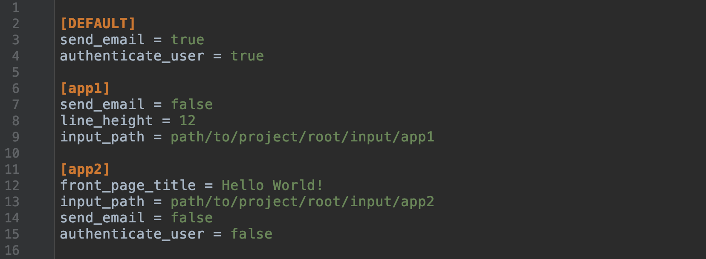
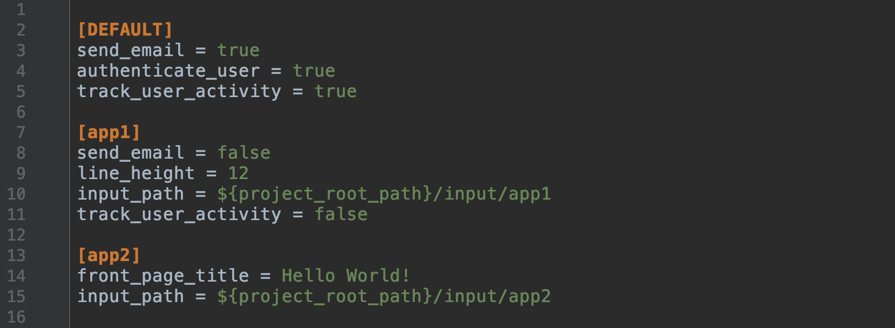
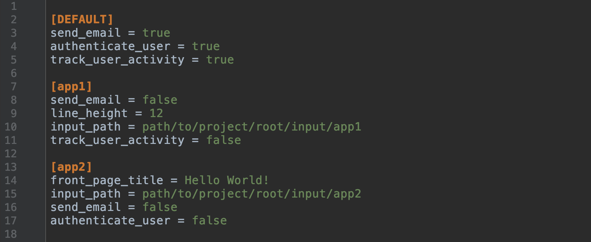

# Config Handler

Handle config files in your projects the easy way.

[](https://badge.fury.io/py/config-handler)
[](https://travis-ci.com/amphinicy/config-handler)


## Installation

```bash
> pip install config-handler
```

## Rules

#### Rule #1  
Use INI files for config.  
Regarding that please follow INI file language: [https://en.wikipedia.org/wiki/INI_file](https://en.wikipedia.org/wiki/INI_file)

#### Rule #2  
Use only strings, integers and booleans.  
If you need to use anything else, the design isn't right.

#### Rule #3  
Don't put your config file (config.ini) in git repository.  
Instead you have a config template file (config.ini.template).

#### Rule #4  
Config file should contain ONLY the stuff that could be changed by user.  
If you have the data that will never change, use constants.

## Config template file

This is how config.ini.template file should look like:  


config.ini.template file supports template variables (`${project_root_path}`).

## Usage

#### Scenario #1  

You are running your app for the first time and config.ini doesn't exist yet.  
So you need to create it from config.ini.template file (use template variables if needed):

```python
import os
from config_handler import ConfigHandler

template_config_variables = {
    'project_root_path': os.path.join('path', 'to', 'project', 'root')
}
ConfigHandler('./config.ini').sync(template_config_variables)
``` 
 
After this call, config.ini file was created in the same directory where config.ini.template is located and should look like this:


#### Scenario #2  

Now read your newly created config.ini: 
  
```python
from config_handler import ConfigHandler

config = ConfigHandler('./config.ini').read()

print(config.sections())
# >>> ['app1', 'app2']

print(dict(config['DEFAULT']))
# >>> {'send_email': 'true', 'authenticate_user': 'true'}

print(dict(config['app1']))
# >>> {'send_email': 'false', 'line_height': '12', 'input_path': 'path/to/project/root/input/app1', 'authenticate_user': 'true'}

print(config['DEFAULT']['send_email'])
# >>> 'true'

print(config['app1']['front_page_title'])
# >>> 'Hello World!'

print(config.getboolean('DEFAULT', 'send_email'))
# >>> True

print(config.getboolean('app2', 'send_email'))
# >>> False
``` 
 
`.read()` returns `ConfigParser` objects from python's native [Configuration file parser lib](https://docs.python.org/3/library/configparser.html)  

#### Scenario #3  

User made some changes in config.ini file:  



And some changes are made in config.ini.template file by the developers:

  

Then you need to run sync again:  

```python
import os
from config_handler import ConfigHandler

template_config_variables = {
    'project_root_path': os.path.join('path', 'to', 'project', 'root')
}
ConfigHandler('./config.ini').sync(template_config_variables)
```  

After the sync, config.ini file should look like this:  

  

So, what user changes or adds stays in config.ini.  
Everything new that was added in config.ini.template was added in config.ini as well.

#### Scenario #4  

You can sync and read at the same time: 
  
```python
from config_handler import ConfigHandler

config = ConfigHandler('./config.ini').sync({...}).read()

...
``` 
